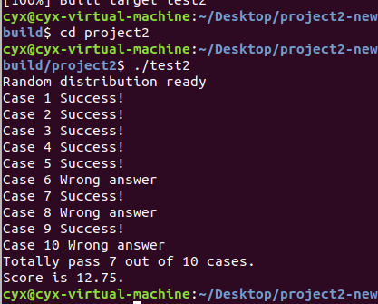

# 编译技术Project2报告

## 小组分工

小组成员：

- 竹添林洋一 1700094802
- 贾一萌 1700013021
- 程宇轩 1700012969

本次 Project 主要由程宇轩、贾一萌完成（竹添林洋一完成了 Project1，并为本次 Project 提供了很多经验）。

## 自动求导技术设计

对于只有加号和乘号的式子，如 $L = T \times A \times B$ ：

求微分得 $\partial L = \partial T \times A \times B + T \times \partial A \times  B + T \times A \times \partial B$ ，

对 $loss$ 微分得  ${\partial L \over \partial loss} = {\partial T \over \partial loss} \times A \times B + T \times {\partial A \over \partial loss} \times B + T \times A \times {\partial B \over \partial loss}$,

对于 $T$ 来说 ${\partial L \over \partial loss} = {\partial T \over \partial loss} \times A \times B$ ，即得到 $dT = dL \times A \times B$ 。

## 实现流程

实现思路是，将新的 json 转为 Project1 可求的 json，从而利用Project1的程序来生成代码。

将 Kernel 中的式子分析得到抽象语法树，并依据求导规则对书上的每个节点进行求导，得到求导之后的抽象语法树，再将其输出，就可以得到一个新的 json，然后利用 Project1 的程序生成代码。

## 实验结果

通过了所有只有乘号和加号的测试点：



## 使用到的编译知识，讲解如何实现

在进行 json 的转换时，我们构造了 Kernel 的抽象语法树。我们的做法可以对只包含乘号和加号的 Kernel 进行正确的转化。

语法规则如下：

```
E1 -> E1 + E2 | E2
E2 -> E2 * E3 | E3
E3 -> id
```

E1代表表达式节点， E2代表若干个元素相乘。

抽象语法树节点：

```c++
enum NodeType{
    e1, e2, e3
};
struct Node {
    NodeType type;
    String str;
    vector<Node> sons;
    bool d;
    
    ...
}
```

sons 表示它的子节点，d 表示该变量是否是被微分的量。

从字符串得到抽象语法树只需要先按 `=` 和 `+` 拆分，再按 `*` 拆分即可。整个表达式为 E1，用 `=` 和 `+` 拆分 E1 得到 E1 的若干个子节点 E2，再用 `*` 拆分 E2 得到 E2 的若干个子节点 E3，抽象语法树即可构造完毕。

然后按照求导规则，对 E1 进行求导，通过一次对抽象语法树的遍历实现。

接下来，关键的一步是交换 dL 和 dT，先通过一次抽象语法树的遍历，获得左值和被求导值的全名（包括 < >）在内的部分，然后通过下面的遍历函数进行交换。

```c++
void swaplt(string lhs, string tar, string lhs_full, string tar_full) {
    if(type == NodeType::e3) {
        if(d) { 
            if(name() == lhs) {
                str = tar_full;
            } else if(name() == tar) {
                str = lhs_full;
            }
        }
    } else {
        for(unsigned i = 0; i < sons.size(); i++) {
            sons[i].swaplt(lhs, tar, lhs_full, tar_full);
        }
        calcStr(); // 子节点发生改变，重新计算该节点生成的字符串
    }
}
```

得到抽象语法树以后，对其求微分。

主要的过程如下：

```c++
        Node p = Node(NodeType::e1, kernel); // 通过字符串 kernel 构造抽象语法树，p为根节点
        String tar, lhs_full, tar_full;
        Vector<String> kernels; // 存放准备新生成的 json 中的 kernel
        set<string> ins2; // 存放需要的输入变量
        for(unsigned i = 0; i < tars.size(); i++) {
        	tar = tars[i]; // 被求导变量
			Node np = p.getD(lhs, tar); // 遍历抽象语法树，对整个式子求微分
			np.get_full(lhs, tar, lhs_full, tar_full); // 遍历抽象语法树，找到左值和被求导值的全称
			np.swaplt(lhs, tar, lhs_full, tar_full); // 交换所有的 dL< > 和 dT < >
			kernels.push_back(package(np.str)); // 用新的抽象语法树生成字符串，输出到新的 json 中
        	np.collectIns(ins2); // 遍历抽象语法树，收集需要的输入变量
		}
```

